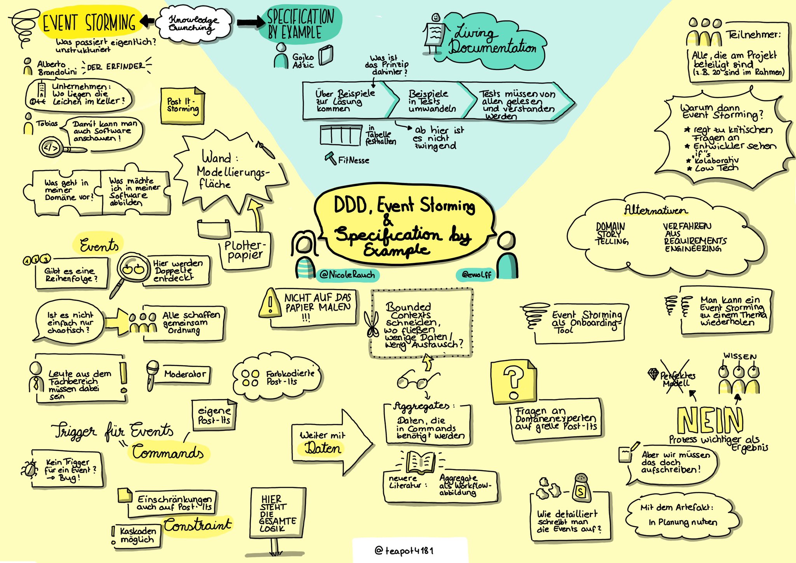

Diese Woche ist Nicole Rauch zu Gast. Mit Event Storming kann man
Domain-driven Design ganz praktisch und kollaborativ umsetzen. Und
Specification by Example stellt sicher, dass man auch das richtige
baut.

Buch-Tipp: [Bridging the Communication Gap: Specification by Example and Agile Acceptance Testing](https://www.goodreads.com/book/show/6443938-bridging-the-communication-gap) von Gojko Adzic 

