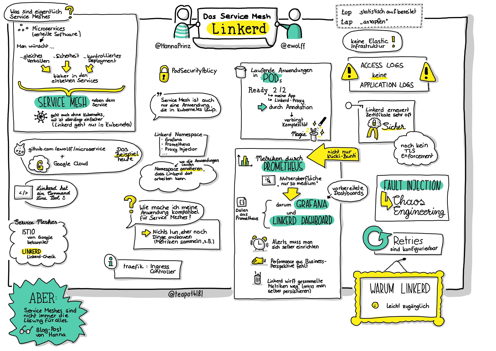

Service Meshes sind vor allem als Infrastruktur für Microservices
nützlich. In dieser Folge schauen wir uns Demos für das Service Mesh
Linkerd an. Als Service-Mesh-Expertin erklärt Hanna Prinz uns die
Details und warum sie sich für Linkerd so begeistert.

* [Demo Linkerd](https://github.com/ewolff/microservice-linkerd)
* [Service Mesh Überblick](https://servicemesh.es/)
* [Service Mesh Primer](https://leanpub.com/service-mesh-primer)
* [Linkerd Tutorials](https://linkerd.io/2/tasks/)
* [Hannas Blog-Beitrag "Happy Without a Service Mesh"](https://www.innoq.com/en/blog/happy-without-a-service-mesh/)

