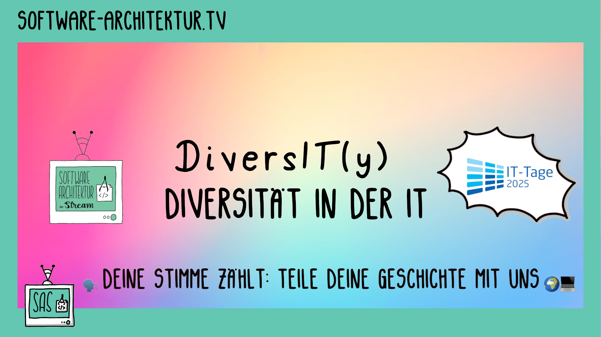

Einmal in der Woche diskutiert Eberhard Wolff, Lisa Schäfer oder Ralf
D. Müller
Software-Architektur im
Live-Stream auf YouTube, Twitch und manchmal LinkedIn - oft zusammen mit einem
Gast. Zuschauer können über den Chat und
das Formular unten mitdiskutieren oder Fragen
stellen. 
Die Aufnahme steht danach als Video und Podcast zur Verfügung.

## Umfrage DiversIT(y): Diversität in der IT

Für unsere Special Episode live von den IT-Tagen zum Thema "Diversität
in der IT" suchen wir persönliche Erfahrungsberichte von Menschen, die
in der Tech-Branche unterrepräsentiert sind oder sich dort nicht immer
willkommen gefühlt haben. 👩🏽‍💻👨🏻‍💻🧑🏿‍💻🌈♿

<a
href="https://tally.so/r/w76VV6">
Hier geht es zur Umfrage
</a>

## Next Episode: Thurday 2025-11-06 13:00 CET Team Work – Do we still need to talk about it? with Aino Vonge Corry and Lisa Maria Schäfer



<section id="content-links">
	<a href="https://www.linkedin.com/events/7387439364940734465/">LinkedIn</a>
	<a href="https://www.twitch.tv/ebrwolff">Twitch</a>
	<a href="https://www.youtube.com/@EberhardWolff">YouTube Channel</a>
</section>

In IT most of us need to work in teams for various reasons, and if you
think that is not always easy, this is the stream you should join. We
think a lot has been said about team work already, but let us dive
into various aspects together; team topologies, psychological safety,
personality types, body language, remote work and teams and just plain
old communication. Aino Vonge Corry and Lisa Maria Schäfer are
discussing all those topics and are happily looking forward to your
questions. Aino will also have a talk at Software Architecture
Gathering called "What We (Should Have) Learned From Lord of the
Rings".

<!-- https://claude.ai/public/artifacts/e3c372ae-47cd-4706-9316-61aafb0be64a -->

[Zum Kalendar hinzufügen](stream.ics)

## Fragen, Diskussion und Anregungen

Fragen, Diskussion und Anregungen für die Episode oder den Stream gerne im Twitch-Chat oder
YouTube-Chat oder anonym hier:

Questions, discussion, and suggestions are welcome in the Twitch chat or the
YouTube chat or
anonymously here:



## Neueste Folgen






## Lizenz

Inhalte von Software-Architektur im Stream zu konsumieren ist
[unvereinbar mit einer Unterstützung der AfD](/2024/01/22/folge198.html).

[Creative Commons Attribution 4.0 Unported
License](http://creativecommons.org/licenses/by/4.0/)

Attributiert werden sollen:

* Für Videos Eberhard Wolff, Ralf D. Müller oder Lisa Maria Schäfer und die jeweiligen Interviewten
* Für Sketchnotes Lisa Maria Schäfer

